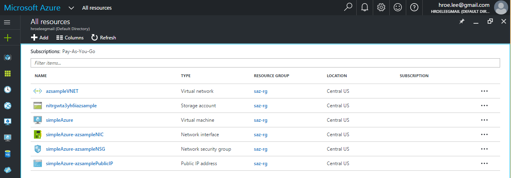

.. _ref-saz-template-deploy:

Deploying Azure Virtual Machine in Simple Azure ARM Mode
===============================================================================

Simpla Azure deploys a Ubuntu 16.04 VM using `the sample template
<https://github.com/Azure-Samples/resource-manager-python-template-deployment/blob/master/templates/template.json>`_
from `Azure-Samples
<https://github.com/Azure-Samples/resource-manager-python-template-deployment/>`_ like this:

::

  >> import simpleazure as saz
  >> arm = saz.arm()
  >> url = "https://raw.githubusercontent.com/Azure-Samples/resource-manager-python-template-deployment/master/templates/template.json"
  >> arm.deploy(template = url, param = { "sshKeyData": "ssh-rsa AAAB3Nza..." })

A new deployment is completed in a resource group like:

Deleting a deployment is::

  >> a.terminate_deployment()

Or removing a resource group is::

  >> a.remove_resource_group()

.. tips:: ``>>`` indicates Python interactive shell and ``$`` indicates bash
        shell in this document.

Overview
-------------------------------------------------------------------------------

Azure Virtual Machine is used to start via the servicemanagement API in Python
(which is now legacy or classic mode) with limited access to resources but new
Azure Resource Manager (ARM) supports launching a virtual machine with its
template for a service deployment. This page demonstrates how to start
a virtual machine in Simple Azure ARM mode with the template which contains
information of resoures to be deployed e.g.  Virtual Machine and Virtual
Network with Resource Groups. Simple Azure is able to load custom templates
from a file or a web and use the official community templates
`Azure-QuickStart-Templates
<https://github.com/Azure/azure-quickstart-templates/>`_.

.. note:: ARM does not support the classic version of virtual machines and
        cloud services which are only available via ServiceManagementAPI.
        VMs launched via ARM do not appear on ASM listing and vice versa.

ARM JSON Template
-------------------------------------------------------------------------------

Azure Resource Template uses JSON format to describe its parameters, variables,
resources and outputs. For example, the blank template looks like::

  {
     "$schema": "http://schema.management.azure.com/schemas/2015-01-01/deploymentTemplate.json#",
     "contentVersion": "1.0.0.0",
     "parameters": {  },
     "resources": [  ]
  }

* This basic template is obtained from the azure portal:
  https://portal.azure.com/#create/Microsoft.MyGallery

- ``resources`` contains definition of azure services to be deployed e.g.
  Virtual Machine. Also, this entity is mandatory.
- ``parameters`` contains input values which allow you to provide when template
  is deployed.

.. note:: For more information about data structure of resources and
        parameters, see the 'authoring templates' here:
        https://azure.microsoft.com/en-us/documentation/articles/resource-group-authoring-templates/

In addition, there are variables and outputs which are recommended to add
according to `the official templates
<https://github.com/Azure/azure-quickstart-templates>`_.

.. note:: Need to setup credentials for ARM? see the Azure Resource Manager
        page here :ref:`ref-arm`

Starting a VM with Simple Azure (step-by-step)
-------------------------------------------------------------------------------

``arm`` sub package is added under ``simpleazure``. Try::

  >> import simpleazure
  >> arm = simpleazure.arm()

Credentials
^^^^^^^^^^^^^^^^^^^^^^^^^^^^^^^^^^^^^^^^^^^^^^^^^^^^^^^^^^^^^^^^^^^^^^^^^^^^^^^

The following Azure credentials are required to use ARM template on
SimpleAzure. Credentials for ASM (Azure Service Management API) are not valid
for ARM.

- subscription id       (equal to env name ``AZURE_SUBSCRIPTION_ID``)
- client id             (equal to env name ``AZURE_CLIENT_ID``)
- tenant id             (equal to env name ``AZURE_TENANT_ID``)
- client secret key     (equal to env name ``AZURE_CLIENT_SECRET``)

You may not be familiar with client id and client secret key, see the page here
':ref:`ref-arm`'. Client id and secret key can be obtained via Azure CLI or the
new portal.

You can deliver credential values as parameters in Python Shell like::

  >> sid = "5s3ag2s5-2aa1-4828-xxxx-9g8sw72w5w5g"
  >> cid = "5c5a3ea3-ap34-4pd0-xxxx-2p38ac00aap1"
  >> secret = "xxxxxxxxxxxxxxxxx"
  >> tid = "5e39a20e-c55a-53de-xxxx-2503a55et6ta"
  >> arm.set_credential(subscription = sid, client_id = cid, secret = secret, tenant = tid)

It is actually recommended to use environment variables. Create a file for credentials like::

        $ cat <<EOF > ~/.saz/cred
        export AZURE_SUBSCRIPTION_ID=5s3ag2s5-2aa1-4828-xxxx-9g8sw72w5w5g
        export AZURE_CLIENT_ID=5c5a3ea3-ap34-4pd0-xxxx-2p38ac00aap1
        export AZURE_TENANT_ID=5e39a20e-c55a-53de-xxxx-2503a55et6ta
        export AZURE_CLIENT_SECRET=xxxx
        EOF

And then source it before running Python like:

::

        $ source ~/.saz/cred

Now. no parameters are necessary. Simple Azure loads credentials from environment variables::

  >> arm.set_credential()

Load Template
^^^^^^^^^^^^^^^^^^^^^^^^^^^^^^^^^^^^^^^^^^^^^^^^^^^^^^^^^^^^^^^^^^^^^^^^^^^^^^^

We want to use `101-vm-sshkey
<https://github.com/Azure/azure-quickstart-templates/tree/master/101-vm-sshkey>`_
template from the *azure-quickstart-templates* which deploys a Ubuntu
14.04.4-LTS Virtual Machine with a SSH key injection. ``deploy()`` accepts template
from URL or a local file as long as it is a JSON format.

From URL::

        >> template_url = 'https://raw.githubusercontent.com/Azure/azure-quickstart-templates/master/101-vm-sshkey/azuredeploy.json'
        >> arm.set_template(template_url)

From FILE::

        >> template_path = "~/101-vm-sshkey/azuredeploy.json"
        >> arm.set_template(template_path)

Set Parameters
^^^^^^^^^^^^^^^^^^^^^^^^^^^^^^^^^^^^^^^^^^^^^^^^^^^^^^^^^^^^^^^^^^^^^^^^^^^^^^^

``101-vm-sshkey`` template requires ssh public key parameter to deploy a VM.
Simple Azure loads a public key string from the base ssh directory ($HOME/.ssh).

We assume that you already have a SSH key pair generated with a default filename
(``~/.ssh/id_rsa.pub`` and ``id_rsa``) in your home directory. ``sshkey``
object contains public key string like:

::
        
        >> arm.sshkey.pubkey
        ssh-rsa AAAAB3... hrlee@quickstart

We provide this as a parameter like:

::

        >> arm.set_parameter({"sshKeyData": arm.sshkey.pubkey})

.. note:: sshKeyData is a parameter name defined in the template

Deployment
^^^^^^^^^^^^^^^^^^^^^^^^^^^^^^^^^^^^^^^^^^^^^^^^^^^^^^^^^^^^^^^^^^^^^^^^^^^^^^^

The ``101-vm-sshkey`` template contains six (6) resources: 1 Compute, 4 Network
and 1 Storage to deploy a Ubuntu VM on Azure. Exact resource names are:

- Microsoft.Compute/virtualMachines   
- Microsoft.Network/networkInterfaces       
- Microsoft.Network/networkSecurityGroups
- Microsoft.Network/publicIPAddresses
- Microsoft.Network/virtualNetworks          
- Microsoft.Storage/storageAccounts

The relations of these services are visualized via armvis.io `here
<http://armviz.io/#/?load=https%3A%2F%2Fraw.githubusercontent.com%2FAzure%2Fazure-quickstart-templates%2Fmaster%2F101-vm-sshkey%2Fazuredeploy.json>`_

In Simple Azure, ``deploy()`` function creates a new deployment for these six
resources by::

        >> arm.deploy()

You can directly call ``deploy()`` function without setting template
(set_template()) and parameters (set_parameter()) but sending them as function
parameters like (Both ways work same):

::

  >> arm.deploy(template_url, parameters)

The status of a deployment is visible on the Azure Portal like:

It may take several minutes to get the VM ready to access via SSH your your
key.

Termination
^^^^^^^^^^^^^^^^^^^^^^^^^^^^^^^^^^^^^^^^^^^^^^^^^^^^^^^^^^^^^^^^^^^^^^^^^^^^^^^

When Simple Azure terminates VMs in a classic mode (which is using
ServiceManagement API), each service needs to be deleted seperately, e.g.
storage, cloud services and virtual machines. In ARM mode, however, a simple
function call deletes resources in a same unit (a sample resource group or
deployment).

Deleting a deployment is::

  >> arm.terminate_deployment()

Removing a resource group is ::

  >> arm.remove_resource_group()

Deployment name or resource group name can be specified as a parameter, if you
want to clean up other resources as well.

The following sections are for further readings about defining resources in a
template.

Further Reading: Virtual Machine in Resources
-------------------------------------------------------------------------------

Starting a new virtual machine (*"Microsoft.Compute/virtualMachines"*)
requires Storage account and Network resources to store image file (.vhd) and
configure a network interface with a public ip address. (This is probably
different for Windows machines) Therefore, additional resources are expected in
the ``resources`` entity to complete vm deployment.

.. comment:: ``hardwareProfile``, ``storageProfile``, and ``networkProfile``.

It might be helpful to review virtual machine service from  one of the existing
templates. There is a template starting a VM with ssh public key:
`101-vm-ssh-key template
<https://github.com/Azure/azure-quickstart-templates/blob/master/101-vm-sshkey/azuredeploy.json>`_
, and the virtual machine service is defined like this in ``resources``::

        {
          "apiVersion": "2015-08-01",
          "type": "Microsoft.Compute/virtualMachines",
          "name": "simpleazure",
          "location": "centralus",
          "properties": {
            "hardwareProfile": {
            "vmSize": "Standard_DS2"
            },
            "osProfile": {
              "computerName": "simpleazure",
              "adminUsername": "ubuntu",
              "linuxConfiguration": {
                "disablePasswordAuthentication": "true",
                "ssh": {
                  "publicKeys": [
                    {
                      "keyData": "GEN-SSH-PUB-KEY"
                    }
                  ]
                }
              }
            },
            "storageProfile": {
              "imageReference": {
                "publisher": "Canonical",
                "offer": "UbuntuServer",
                "sku": "14.04-LTS",
                "version": "latest"
              },
              "osDisk": {
                "name": "osdisk",
                "vhd": {
                  "uri": "[variables('storage_uri')]"
                },
                "createOption": "FromImage"
              }
            },
            "networkProfile": {
              {
                "id": "[resourceId('Microsoft.Network/networkInterfaces', variables('nicName'))]"
              }
            }
          }
        }

There are other elements available but only required ones are demonstrated in
this example according to the `ARM schemas
<https://github.com/Azure/azure-resource-manager-schemas/blob/master/schemas/2015-08-01/Microsoft.Compute.json>`_

